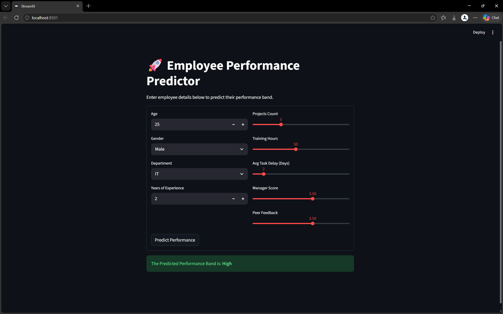

# 📊 Employee Performance Predictor (People Analytics)

An industry-oriented Machine Learning system built to predict employee performance bands (High, Medium, Low) using classification algorithms. This project demonstrates a full-stack data science lifecycle from synthetic data generation to a web-based deployment.

## 🚀 Project Overview
This tool allows HR managers to input employee metrics and receive an instant prediction on their upcoming performance rating. It helps organizations:
* [cite_start]**Identify High Performers** for promotion readiness[cite: 23, 460].
* [cite_start]**Detect Low Performance early** to trigger training interventions[cite: 24, 26, 460].
* [cite_start]**Optimize L&D Budgets** by targeting employees who need skill upgrades[cite: 27].

## 💻 Technical Proof of Concept
### Dashboard Preview

## 🛠️ Tech Stack
* **Language:** Python 3.10+
* [cite_start]**ML Model:** Random Forest Classifier (Balanced)[cite: 331, 337, 470].
* [cite_start]**Interface:** Streamlit Dashboard[cite: 404, 407].
* **Libraries:** Pandas, Scikit-Learn, Matplotlib, Seaborn, Joblib.

## 📈 Model Performance
* **Overall Accuracy:** 81%
* **Macro F1-Score:** 0.80
* **Business Insight:** The model identifies 'Low' performers with **94% precision**, providing high reliability for HR intervention strategies.

## 📂 Folder Structure
* [cite_start]`data/`: Contains `employee_data.csv` (1000 records)[cite: 112].
* [cite_start]`models/`: Saved `performance_model.pkl` file[cite: 92, 409].
* [cite_start]`outputs/`: EDA graphs and dashboard screenshots[cite: 134, 184].
* [cite_start]`app.py`: Streamlit web application code[cite: 407].
* [cite_start]`train_model.py`: Script to train and evaluate the AI model[cite: 417].

## 🏃 How to Run Locally
1. Clone the repo: `git clone https://github.com/UbaleAditya/Employee-Performance-Predictor.git`
2. Install dependencies: `pip install -r requirements.txt`
3. Run the Dashboard: `streamlit run app.py`

---
Developed as a Data Science portfolio project to solve real-world People Analytics challenges.